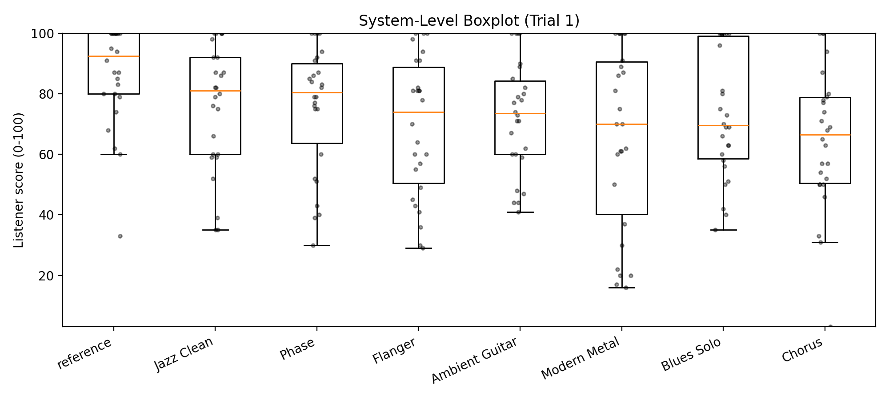
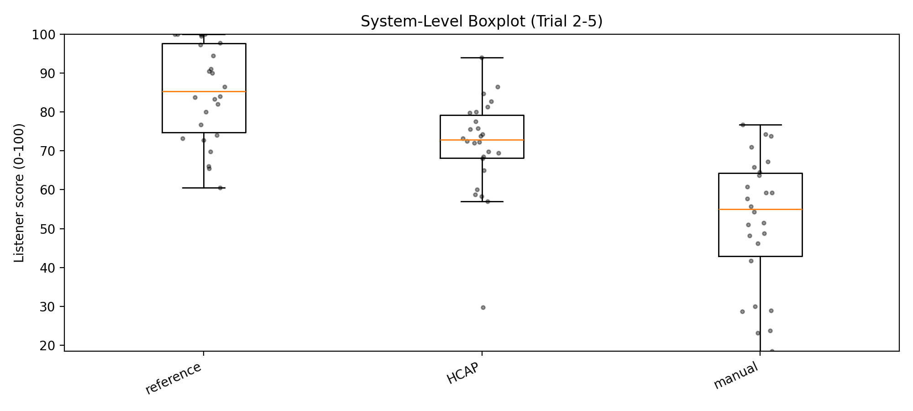
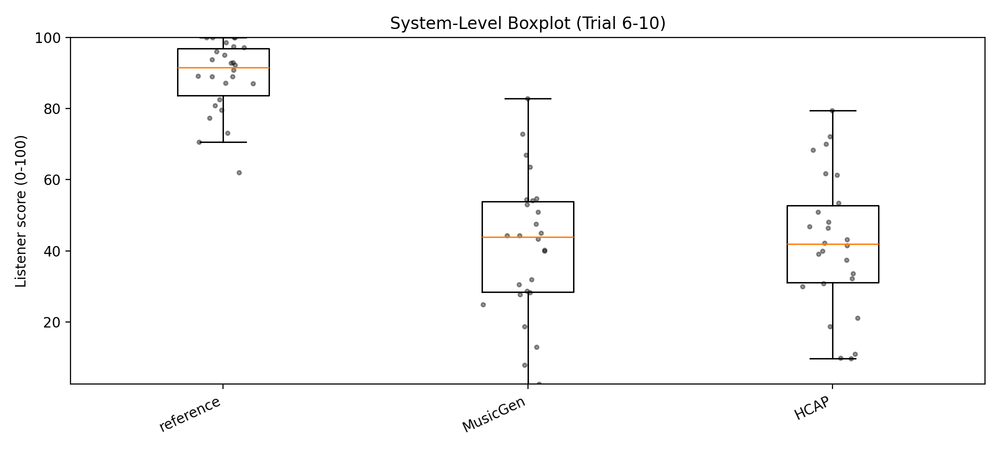

# Multiple-Stimulus Listening Test with Hidden Reference (No Explicit Anchor)

This report summarizes descriptive statistics and repeated-measures tests.
Important: the study includes a hidden reference (`reference`) but no explicit low-quality anchor.

- Input CSV: `/home/xyh/code/Audio-agent/Experiments/mushura/mushra.csv`
- Participants (unique emails): 26
- Total ratings: 910

## Trial 1

### Data Overview
- Trials: ['trial1']
- Ratings (rows): 208
- Participants: 26
- Stimuli: 8 (Ambient Guitar, Blues Solo, Chorus, Flanger, Jazz Clean, Modern Metal, Phase, reference)

### Descriptive Stats (Raw Ratings)
- mean=72.92
- median=77.50
- std=22.72
- min=3.00
- max=100.00

### System-Level Stats (Within-Subject Means)

| Stimulus | n_subj | mean | median | std |
| --- | --- | --- | --- | --- |
| reference | 26 | 86.85 | 92.50 | 16.70 |
| Jazz Clean | 26 | 76.19 | 81.00 | 20.80 |
| Phase | 26 | 75.38 | 80.50 | 20.88 |
| Flanger | 26 | 69.12 | 74.00 | 23.08 |
| Ambient Guitar | 26 | 72.35 | 73.50 | 18.45 |
| Modern Metal | 26 | 65.58 | 70.00 | 30.22 |
| Blues Solo | 26 | 72.96 | 69.50 | 21.19 |
| Chorus | 26 | 64.92 | 66.50 | 23.12 |

### Plot

## Trial 2-5

### Data Overview
- Trials: ['trial2', 'trial3', 'trial4', 'trial5']
- Ratings (rows): 312
- Participants: 26
- Stimuli: 3 (HCAP, manual, reference)

### Descriptive Stats (Raw Ratings)
- mean=69.53
- median=73.50
- std=23.53
- min=0.00
- max=100.00

### System-Level Stats (Within-Subject Means)

| Stimulus | n_subj | mean | median | std |
| --- | --- | --- | --- | --- |
| reference | 26 | 85.33 | 85.25 | 12.52 |
| HCAP | 26 | 71.55 | 72.88 | 12.41 |
| manual | 26 | 51.72 | 55.00 | 17.15 |

### Plot

### Repeated-Measures Tests (Complete Cases)
- n_complete=26
- k_stimuli=3

- Friedman Q=41.6154, p_perm=5e-05 (one-sided)

#### Pairwise Wilcoxon Signed-Rank (Permutation) + Holm Correction

| A | B | n | mean(A-B) | median(A-B) | rbc | p | p(Holm) |
| --- | --- | --- | --- | --- | --- | --- | --- |
| reference | HCAP | 26 | 13.78 | 8.38 | 0.860 | 0.0001 | 0.00015 |
| reference | manual | 26 | 33.61 | 26.00 | 0.983 | 5e-05 | 0.00015 |
| HCAP | manual | 26 | 19.83 | 17.25 | 1.000 | 5e-05 | 0.00015 |

## Trial 6-10

### Data Overview
- Trials: ['trial10', 'trial6', 'trial7', 'trial8', 'trial9']
- Ratings (rows): 390
- Participants: 26
- Stimuli: 3 (HCAP, MusicGen, reference)

### Descriptive Stats (Raw Ratings)
- mean=57.54
- median=59.00
- std=32.24
- min=0.00
- max=100.00

### System-Level Stats (Within-Subject Means)

| Stimulus | n_subj | mean | median | std |
| --- | --- | --- | --- | --- |
| reference | 26 | 89.02 | 91.50 | 10.04 |
| MusicGen | 26 | 41.29 | 43.90 | 19.58 |
| HCAP | 26 | 42.31 | 41.90 | 19.30 |

### Plot

### Repeated-Measures Tests (Complete Cases)
- n_complete=26
- k_stimuli=3

- Friedman Q=36.2308, p_perm=5e-05 (one-sided)

#### Pairwise Wilcoxon Signed-Rank (Permutation) + Holm Correction

| A | B | n | mean(A-B) | median(A-B) | rbc | p | p(Holm) |
| --- | --- | --- | --- | --- | --- | --- | --- |
| reference | MusicGen | 26 | 47.72 | 50.90 | 1.000 | 5e-05 | 0.00015 |
| reference | HCAP | 26 | 46.71 | 51.30 | 0.994 | 5e-05 | 0.00015 |
| MusicGen | HCAP | 24 | -1.10 | 0.80 | 0.067 | 0.7797 | 0.7797 |

