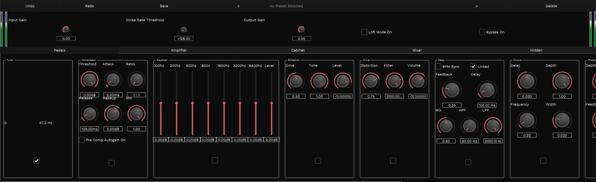
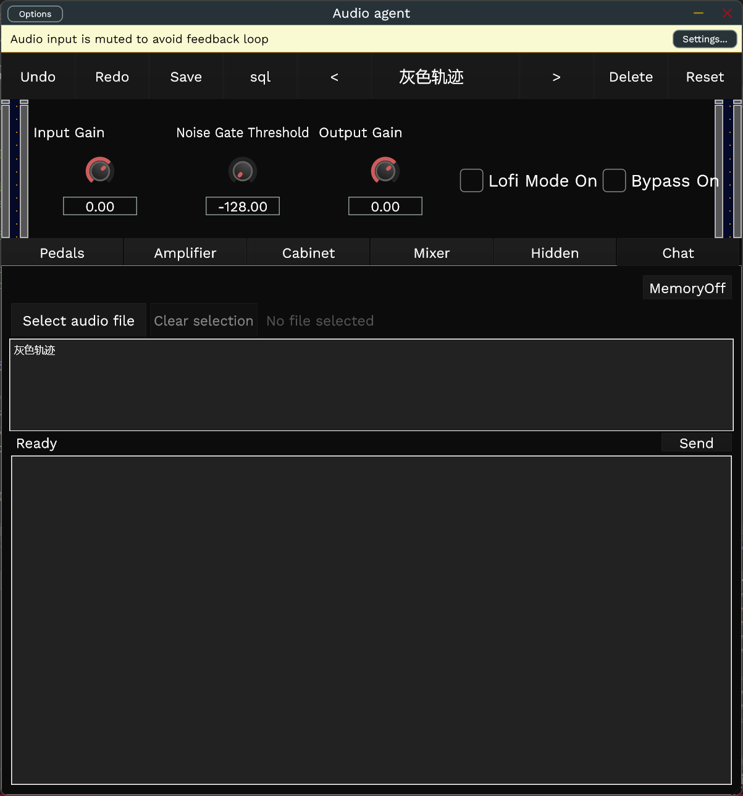

# Supertonal

Supertonal is a work-in-progress guitar multi-effects processor.

Take a listen to a [sample](https://github.com/pauljonescodes/supertonal/tree/master/Sounds).

It's capabilities, in a rough order:

- A tuner
- Gain staging
- Metering
- Noise gate
- Compression (multiple)
- A "screamer"
- A "mouse drive"
- Equilisation (multiple)
- Multi-stage wave-shaping
- Delay
- Chorus
- Phaser
- Flanger
- Bitcrusher
- Cabinet simulation with IR-loading
- Lo-fi mode
- Limiting

# Work Progress:
1. Added a large language model interaction interface, implementing AI-generated parameter functionality.

2. Added a music memory module, achieving personalized learning.

# Experiment Preparation:

## Environment Setup:
1. Open supertonal/Source/Components/PythonApplication/PythonApplication.sln with Visual Studio.
2. Add a virtual environment and install the following packages:
   - scikit-learn
   - openai
   - pandas
   - torch
   - librosa
   - transformers

## Environment Variable Configuration:
1. Add the following three items to your system environment variables:
   - SUPERTONAL_PYTHON_INTERPRETER: "C:\path\to\your\python\env\Scripts\python.exe"
   - SUPERTONAL_PYTHON_SCRIPT1: "C:\path\to\your\supertonal\Source\llm.py"
   - SUPERTONAL_PYTHON_SCRIPT2: "C:\path\to\your\supertonal\Source\sql.py"

Note: Please replace the paths with your actual paths.
It is a work in progress, but I've made a strong effort to keep it portable and buildable with basic knowledge of JUCE. To get it working, simply:

```bash
git clone --recurse-submodules https://github.com/Horusxxhsh/supertonal
```

Then you should be able to open up the `.jucer` file and work in your environment of choice.
